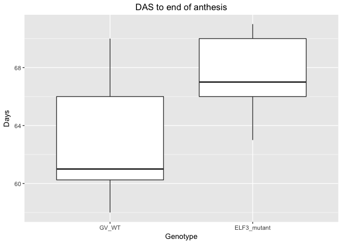
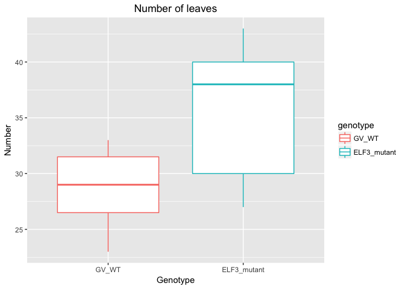

# Phenotyping_script2
Veronica  
6/13/2017  


## Final Phenotyping Data

### Load Data  

```r
(raw.flower <- read_csv("ELF3_flowering.csv", locale = locale(date_format = "%d/%m/%Y")))
```

```
## Parsed with column specification:
## cols(
##   ID = col_integer(),
##   genotype = col_character(),
##   germ = col_date(format = ""),
##   ugly = col_logical(),
##   petals = col_date(format = ""),
##   anthesis = col_date(format = ""),
##   final = col_date(format = ""),
##   Head_diameter = col_double(),
##   final_height = col_double(),
##   internodes = col_integer(),
##   leaves = col_integer(),
##   stem_circ_1 = col_double(),
##   stem_circ_2 = col_double(),
##   stem_circ_3 = col_double(),
##   stem_circ_4 = col_double()
## )
```

```
## # A tibble: 21 × 15
##       ID    genotype       germ  ugly     petals   anthesis      final
##    <int>       <chr>     <date> <lgl>     <date>     <date>     <date>
## 1      1       GV_WT 2017-02-17 FALSE 2017-04-03 2017-04-08 2017-04-16
## 2      2       GV_WT 2017-02-17 FALSE 2017-04-05 2017-04-09 2017-04-19
## 3      3       GV_WT 2017-02-17 FALSE 2017-04-05 2017-04-09 2017-04-16
## 4      4 ELF3_mutant 2017-02-17 FALSE 2017-04-13 2017-04-15 2017-04-24
## 5      5 ELF3_mutant 2017-02-17  TRUE 2017-04-22 2017-04-26 2017-05-04
## 6      6 ELF3_mutant 2017-02-17 FALSE 2017-04-12 2017-04-16 2017-04-25
## 7      7       GV_WT 2017-02-17 FALSE 2017-04-06 2017-04-10 2017-04-19
## 8      8       GV_WT 2017-02-17 FALSE 2017-04-06 2017-04-09 2017-04-19
## 9      9       GV_WT 2017-02-17 FALSE 2017-04-12 2017-04-16 2017-04-23
## 10    10 ELF3_mutant 2017-02-17 FALSE 2017-04-13 2017-04-16 2017-04-25
## # ... with 11 more rows, and 8 more variables: Head_diameter <dbl>,
## #   final_height <dbl>, internodes <int>, leaves <int>, stem_circ_1 <dbl>,
## #   stem_circ_2 <dbl>, stem_circ_3 <dbl>, stem_circ_4 <dbl>
```

```r
(flower <- raw.flower %>%
  filter(ugly == FALSE) %>% 
  mutate(
    days.g2p = parse_integer(petals - germ),
    days.p2a = parse_integer(anthesis - petals),
    days.a2f = parse_integer(final - anthesis),
    days.g2a = parse_integer(anthesis - germ),
    days.g2f = parse_integer(final - germ), 
    leaf_node = leaves / internodes))
```

```
## # A tibble: 20 × 21
##       ID    genotype       germ  ugly     petals   anthesis      final
##    <int>       <chr>     <date> <lgl>     <date>     <date>     <date>
## 1      1       GV_WT 2017-02-17 FALSE 2017-04-03 2017-04-08 2017-04-16
## 2      2       GV_WT 2017-02-17 FALSE 2017-04-05 2017-04-09 2017-04-19
## 3      3       GV_WT 2017-02-17 FALSE 2017-04-05 2017-04-09 2017-04-16
## 4      4 ELF3_mutant 2017-02-17 FALSE 2017-04-13 2017-04-15 2017-04-24
## 5      6 ELF3_mutant 2017-02-17 FALSE 2017-04-12 2017-04-16 2017-04-25
## 6      7       GV_WT 2017-02-17 FALSE 2017-04-06 2017-04-10 2017-04-19
## 7      8       GV_WT 2017-02-17 FALSE 2017-04-06 2017-04-09 2017-04-19
## 8      9       GV_WT 2017-02-17 FALSE 2017-04-12 2017-04-16 2017-04-23
## 9     10 ELF3_mutant 2017-02-17 FALSE 2017-04-13 2017-04-16 2017-04-25
## 10    11 ELF3_mutant 2017-02-17 FALSE 2017-04-07 2017-04-11 2017-04-21
## 11    12 ELF3_mutant 2017-02-17 FALSE 2017-04-12 2017-04-15 2017-04-24
## 12    13       GV_WT 2017-02-24 FALSE 2017-04-23 2017-04-26 2017-05-04
## 13    14       GV_WT 2017-02-24 FALSE 2017-04-16 2017-04-20       <NA>
## 14    15       GV_WT 2017-02-24 FALSE 2017-04-24 2017-04-29 2017-05-05
## 15    16       GV_WT 2017-02-24 FALSE 2017-04-20       <NA>       <NA>
## 16    17       GV_WT 2017-02-24 FALSE 2017-04-16 2017-04-19       <NA>
## 17    18 ELF3_mutant 2017-02-24 FALSE 2017-04-25 2017-04-28 2017-05-06
## 18    19 ELF3_mutant 2017-02-24 FALSE 2017-04-25 2017-04-28 2017-05-06
## 19    20 ELF3_mutant 2017-02-24 FALSE 2017-04-23 2017-04-27 2017-05-05
## 20    21 ELF3_mutant 2017-02-24 FALSE 2017-04-22 2017-04-25 2017-05-05
## # ... with 14 more variables: Head_diameter <dbl>, final_height <dbl>,
## #   internodes <int>, leaves <int>, stem_circ_1 <dbl>, stem_circ_2 <dbl>,
## #   stem_circ_3 <dbl>, stem_circ_4 <dbl>, days.g2p <int>, days.p2a <int>,
## #   days.a2f <int>, days.g2a <int>, days.g2f <int>, leaf_node <dbl>
```

```r
flower$genotype <- factor(flower$genotype, levels = c("GV_WT", "ELF3_mutant"))
```

### Flowering Time  

```r
flower %>%
  ggplot(aes(genotype, days.g2p)) +
  geom_boxplot() +
  ggtitle("DAS to petal emergence") + 
  xlab("Genotype") + 
  ylab("Days") +
  theme(plot.title = element_text(hjust = .5)) 
```

<!-- -->

```r
summary(lmer(days.g2p ~ genotype + (1|germ), data=flower))
```

```
## Linear mixed model fit by REML t-tests use Satterthwaite approximations
##   to degrees of freedom [lmerMod]
## Formula: days.g2p ~ genotype + (1 | germ)
##    Data: flower
## 
## REML criterion at convergence: 96.4
## 
## Scaled residuals: 
##      Min       1Q   Median       3Q      Max 
## -1.47827 -0.58407  0.01938  0.42317  1.91518 
## 
## Random effects:
##  Groups   Name        Variance Std.Dev.
##  germ     (Intercept) 17.527   4.187   
##  Residual              8.094   2.845   
## Number of obs: 20, groups:  germ, 2
## 
## Fixed effects:
##                     Estimate Std. Error     df t value Pr(>|t|)   
## (Intercept)           51.445      3.083  1.073   16.69  0.03150 * 
## genotypeELF3_mutant    4.654      1.279 17.000    3.64  0.00203 **
## ---
## Signif. codes:  0 '***' 0.001 '**' 0.01 '*' 0.05 '.' 0.1 ' ' 1
## 
## Correlation of Fixed Effects:
##             (Intr)
## gntypELF3_m -0.186
```

```r
flower %>%
  ggplot(aes(genotype, days.p2a)) +
  geom_boxplot() +
  ggtitle("Days from petal emergence to anthesis") + 
  xlab("Genotype") + 
  ylab("Days") +
  theme(plot.title = element_text(hjust = .5)) 
```

```
## Warning: Removed 1 rows containing non-finite values (stat_boxplot).
```

<!-- -->

```r
summary(lmer(days.p2a ~ genotype + (1|germ), data=flower))
```

```
## Linear mixed model fit by REML t-tests use Satterthwaite approximations
##   to degrees of freedom [lmerMod]
## Formula: days.p2a ~ genotype + (1 | germ)
##    Data: flower
## 
## REML criterion at convergence: 40.9
## 
## Scaled residuals: 
##     Min      1Q  Median      3Q     Max 
## -1.7330 -0.3151  0.1418  0.6223  1.5597 
## 
## Random effects:
##  Groups   Name        Variance  Std.Dev. 
##  germ     (Intercept) 1.030e-16 1.015e-08
##  Residual             4.974e-01 7.053e-01
## Number of obs: 19, groups:  germ, 2
## 
## Fixed effects:
##                     Estimate Std. Error      df t value Pr(>|t|)    
## (Intercept)           3.9000     0.2230 17.0000  17.487 2.65e-12 ***
## genotypeELF3_mutant  -0.6778     0.3240 17.0000  -2.092   0.0518 .  
## ---
## Signif. codes:  0 '***' 0.001 '**' 0.01 '*' 0.05 '.' 0.1 ' ' 1
## 
## Correlation of Fixed Effects:
##             (Intr)
## gntypELF3_m -0.688
```

```r
flower %>%
  ggplot(aes(genotype, days.a2f)) +
  geom_boxplot() +
  ggtitle("Duration of anthesis") + 
  xlab("Genotype") + 
  ylab("Days") +
  theme(plot.title = element_text(hjust = .5)) 
```

```
## Warning: Removed 3 rows containing non-finite values (stat_boxplot).
```

<!-- -->

```r
summary(lmer(days.a2f ~ genotype + (1|germ), data=flower))
```

```
## Linear mixed model fit by REML t-tests use Satterthwaite approximations
##   to degrees of freedom [lmerMod]
## Formula: days.a2f ~ genotype + (1 | germ)
##    Data: flower
## 
## REML criterion at convergence: 50
## 
## Scaled residuals: 
##     Min      1Q  Median      3Q     Max 
## -1.4854 -0.4568 -0.1980  0.6517  1.5908 
## 
## Random effects:
##  Groups   Name        Variance Std.Dev.
##  germ     (Intercept) 0.3703   0.6086  
##  Residual             1.1338   1.0648  
## Number of obs: 17, groups:  germ, 2
## 
## Fixed effects:
##                     Estimate Std. Error      df t value Pr(>|t|)  
## (Intercept)           7.9439     0.5834  1.6180  13.616   0.0116 *
## genotypeELF3_mutant   0.9048     0.5252 14.3170   1.723   0.1065  
## ---
## Signif. codes:  0 '***' 0.001 '**' 0.01 '*' 0.05 '.' 0.1 ' ' 1
## 
## Correlation of Fixed Effects:
##             (Intr)
## gntypELF3_m -0.497
```

```r
flower %>%
  ggplot(aes(genotype, days.g2a)) +
  geom_boxplot() +
  ggtitle("DAS to anthesis") + 
  xlab("Genotype") + 
  ylab("Days") +
  theme(plot.title = element_text(hjust = .5)) 
```

```
## Warning: Removed 1 rows containing non-finite values (stat_boxplot).
```

<!-- -->

```r
summary(lmer(days.g2a ~ genotype + (1|germ), data=flower))
```

```
## Linear mixed model fit by REML t-tests use Satterthwaite approximations
##   to degrees of freedom [lmerMod]
## Formula: days.g2a ~ genotype + (1 | germ)
##    Data: flower
## 
## REML criterion at convergence: 92.1
## 
## Scaled residuals: 
##      Min       1Q   Median       3Q      Max 
## -1.38662 -0.61161 -0.03278  0.40826  2.04287 
## 
## Random effects:
##  Groups   Name        Variance Std.Dev.
##  germ     (Intercept) 16.395   4.049   
##  Residual              8.502   2.916   
## Number of obs: 19, groups:  germ, 2
## 
## Fixed effects:
##                     Estimate Std. Error     df t value Pr(>|t|)   
## (Intercept)           55.257      3.011  1.096  18.353   0.0268 * 
## genotypeELF3_mutant    4.052      1.341 16.003   3.022   0.0081 **
## ---
## Signif. codes:  0 '***' 0.001 '**' 0.01 '*' 0.05 '.' 0.1 ' ' 1
## 
## Correlation of Fixed Effects:
##             (Intr)
## gntypELF3_m -0.212
```

```r
flower %>%
  ggplot(aes(genotype, days.g2f)) +
  geom_boxplot() +
  ggtitle("DAS to end of anthesis") + 
  xlab("Genotype") + 
  ylab("Days") +
  theme(plot.title = element_text(hjust = .5)) 
```

```
## Warning: Removed 3 rows containing non-finite values (stat_boxplot).
```

<!-- -->

```r
summary(lmer(days.g2f ~ genotype + (1|germ), data=flower))
```

```
## Linear mixed model fit by REML t-tests use Satterthwaite approximations
##   to degrees of freedom [lmerMod]
## Formula: days.g2f ~ genotype + (1 | germ)
##    Data: flower
## 
## REML criterion at convergence: 72.5
## 
## Scaled residuals: 
##     Min      1Q  Median      3Q     Max 
## -1.5959 -0.6343 -0.1550  0.7135  1.7594 
## 
## Random effects:
##  Groups   Name        Variance Std.Dev.
##  germ     (Intercept) 19.676   4.436   
##  Residual              4.352   2.086   
## Number of obs: 17, groups:  germ, 2
## 
## Fixed effects:
##                     Estimate Std. Error     df t value Pr(>|t|)   
## (Intercept)           64.420      3.233  1.064  19.925  0.02671 * 
## genotypeELF3_mutant    3.812      1.035 14.033   3.684  0.00244 **
## ---
## Signif. codes:  0 '***' 0.001 '**' 0.01 '*' 0.05 '.' 0.1 ' ' 1
## 
## Correlation of Fixed Effects:
##             (Intr)
## gntypELF3_m -0.179
```

### Head, Height, Leaves  

```r
flower %>%
  ggplot(aes(genotype, Head_diameter)) +
  geom_boxplot() +
  ggtitle("Head diameter") + 
  xlab("Genotype") + 
  ylab("Diameter (cm)") +
  theme(plot.title = element_text(hjust = .5)) 
```

```
## Warning: Removed 3 rows containing non-finite values (stat_boxplot).
```

<!-- -->

```r
summary(lmer(Head_diameter ~ genotype + (1|germ), data=flower))
```

```
## Linear mixed model fit by REML t-tests use Satterthwaite approximations
##   to degrees of freedom [lmerMod]
## Formula: Head_diameter ~ genotype + (1 | germ)
##    Data: flower
## 
## REML criterion at convergence: 63.3
## 
## Scaled residuals: 
##      Min       1Q   Median       3Q      Max 
## -1.52444 -0.57909  0.08075  0.60994  1.86429 
## 
## Random effects:
##  Groups   Name        Variance Std.Dev.
##  germ     (Intercept) 0.5373   0.733   
##  Residual             2.8293   1.682   
## Number of obs: 17, groups:  germ, 2
## 
## Fixed effects:
##                     Estimate Std. Error      df t value Pr(>|t|)   
## (Intercept)          12.7608     0.8063  1.8300  15.827  0.00571 **
## genotypeELF3_mutant   0.2166     0.8276 14.4370   0.262  0.79724   
## ---
## Signif. codes:  0 '***' 0.001 '**' 0.01 '*' 0.05 '.' 0.1 ' ' 1
## 
## Correlation of Fixed Effects:
##             (Intr)
## gntypELF3_m -0.562
```

```r
flower %>%
  ggplot(aes(genotype, final_height)) +
  geom_boxplot() +
  ggtitle("Mature height") + 
  xlab("Genotype") + 
  ylab("Height (cm)") +
  theme(plot.title = element_text(hjust = .5)) 
```

```
## Warning: Removed 4 rows containing non-finite values (stat_boxplot).
```

<!-- -->

```r
summary(lmer(final_height ~ genotype + (1|germ), data=flower))
```

```
## Linear mixed model fit by REML t-tests use Satterthwaite approximations
##   to degrees of freedom [lmerMod]
## Formula: final_height ~ genotype + (1 | germ)
##    Data: flower
## 
## REML criterion at convergence: 122.1
## 
## Scaled residuals: 
##     Min      1Q  Median      3Q     Max 
## -1.4653 -0.8059  0.1964  0.8539  1.3958 
## 
## Random effects:
##  Groups   Name        Variance Std.Dev.
##  germ     (Intercept) 739.9    27.20   
##  Residual             211.3    14.53   
## Number of obs: 16, groups:  germ, 2
## 
## Fixed effects:
##                     Estimate Std. Error      df t value Pr(>|t|)  
## (Intercept)          169.219     20.067   1.097   8.432   0.0624 .
## genotypeELF3_mutant   -8.085      7.420  13.026  -1.090   0.2957  
## ---
## Signif. codes:  0 '***' 0.001 '**' 0.01 '*' 0.05 '.' 0.1 ' ' 1
## 
## Correlation of Fixed Effects:
##             (Intr)
## gntypELF3_m -0.215
```

```r
flower %>%
  ggplot(aes(genotype, internodes)) +
  geom_boxplot() +
  ggtitle("Number of internodes") + 
  xlab("Genotype") + 
  ylab("Number") +
  theme(plot.title = element_text(hjust = .5)) 
```

<!-- -->

```r
summary(lmer(internodes ~ genotype + (1|germ), data=flower))
```

```
## Linear mixed model fit by REML t-tests use Satterthwaite approximations
##   to degrees of freedom [lmerMod]
## Formula: internodes ~ genotype + (1 | germ)
##    Data: flower
## 
## REML criterion at convergence: 99
## 
## Scaled residuals: 
##      Min       1Q   Median       3Q      Max 
## -2.04050 -0.36708 -0.00164  0.30909  1.62592 
## 
## Random effects:
##  Groups   Name        Variance Std.Dev.
##  germ     (Intercept) 16.633   4.078   
##  Residual              9.438   3.072   
## Number of obs: 20, groups:  germ, 2
## 
## Fixed effects:
##                     Estimate Std. Error     df t value Pr(>|t|)   
## (Intercept)           24.073      3.030  1.089   7.946  0.06749 . 
## genotypeELF3_mutant    4.127      1.381 17.000   2.989  0.00825 **
## ---
## Signif. codes:  0 '***' 0.001 '**' 0.01 '*' 0.05 '.' 0.1 ' ' 1
## 
## Correlation of Fixed Effects:
##             (Intr)
## gntypELF3_m -0.205
```

```r
flower %>%
  ggplot(aes(genotype, leaves, color = genotype)) +
  geom_boxplot() +
  ggtitle("Number of leaves") + 
  xlab("Genotype") + 
  ylab("Number") +
  theme(plot.title = element_text(hjust = .5)) 
```

<!-- -->

```r
summary(lmer(leaves ~ genotype + (1|germ), data=flower))
```

```
## Linear mixed model fit by REML t-tests use Satterthwaite approximations
##   to degrees of freedom [lmerMod]
## Formula: leaves ~ genotype + (1 | germ)
##    Data: flower
## 
## REML criterion at convergence: 105.4
## 
## Scaled residuals: 
##      Min       1Q   Median       3Q      Max 
## -1.65537 -0.70732  0.04809  0.44146  2.63036 
## 
## Random effects:
##  Groups   Name        Variance Std.Dev.
##  germ     (Intercept) 13.01    3.607   
##  Residual             13.94    3.733   
## Number of obs: 20, groups:  germ, 2
## 
## Fixed effects:
##                     Estimate Std. Error     df t value Pr(>|t|)   
## (Intercept)           29.038      2.789  1.163  10.414  0.04322 * 
## genotypeELF3_mutant    6.564      1.678 17.000   3.912  0.00112 **
## ---
## Signif. codes:  0 '***' 0.001 '**' 0.01 '*' 0.05 '.' 0.1 ' ' 1
## 
## Correlation of Fixed Effects:
##             (Intr)
## gntypELF3_m -0.271
```

```r
flower %>%
  ggplot(aes(genotype, leaf_node)) +
  geom_boxplot() +
  ggtitle("Leaves per internodes") + 
  xlab("Genotype") + 
  ylab("Number leaves:Number internodes") +
  theme(plot.title = element_text(hjust = .5)) 
```

<!-- -->

```r
summary(lmer(leaf_node ~ genotype + (1|germ), data=flower))
```

```
## Linear mixed model fit by REML t-tests use Satterthwaite approximations
##   to degrees of freedom [lmerMod]
## Formula: leaf_node ~ genotype + (1 | germ)
##    Data: flower
## 
## REML criterion at convergence: 4.9
## 
## Scaled residuals: 
##     Min      1Q  Median      3Q     Max 
## -0.8861 -0.5891 -0.2288  0.2481  3.5019 
## 
## Random effects:
##  Groups   Name        Variance Std.Dev.
##  germ     (Intercept) 0.00000  0.0000  
##  Residual             0.05946  0.2438  
## Number of obs: 20, groups:  germ, 2
## 
## Fixed effects:
##                     Estimate Std. Error       df t value Pr(>|t|)    
## (Intercept)          1.22671    0.07352 18.00000  16.685 2.14e-12 ***
## genotypeELF3_mutant  0.06935    0.10960 18.00000   0.633    0.535    
## ---
## Signif. codes:  0 '***' 0.001 '**' 0.01 '*' 0.05 '.' 0.1 ' ' 1
## 
## Correlation of Fixed Effects:
##             (Intr)
## gntypELF3_m -0.671
```

### Stem circumfrence  

```r
flower %>%
  ggplot(aes(genotype, stem_circ_1)) +
  geom_boxplot() +
  ggtitle("Stem circumfrence, internode 1") + 
  xlab("Genotype") + 
  ylab("Circumfrence (cm)") +
  theme(plot.title = element_text(hjust = .5)) 
```

```
## Warning: Removed 7 rows containing non-finite values (stat_boxplot).
```

<!-- -->

```r
summary(lmer(stem_circ_1 ~ genotype + (1|germ), data=flower))
```

```
## Linear mixed model fit by REML t-tests use Satterthwaite approximations
##   to degrees of freedom [lmerMod]
## Formula: stem_circ_1 ~ genotype + (1 | germ)
##    Data: flower
## 
## REML criterion at convergence: 36.3
## 
## Scaled residuals: 
##     Min      1Q  Median      3Q     Max 
## -0.9931 -0.7359 -0.1476  0.2975  2.3641 
## 
## Random effects:
##  Groups   Name        Variance Std.Dev.
##  germ     (Intercept) 0.000    0.000   
##  Residual             1.133    1.065   
## Number of obs: 13, groups:  germ, 2
## 
## Fixed effects:
##                     Estimate Std. Error      df t value Pr(>|t|)    
## (Intercept)           7.8833     0.4346 11.0000  18.140 1.52e-09 ***
## genotypeELF3_mutant   0.2738     0.5923 11.0000   0.462    0.653    
## ---
## Signif. codes:  0 '***' 0.001 '**' 0.01 '*' 0.05 '.' 0.1 ' ' 1
## 
## Correlation of Fixed Effects:
##             (Intr)
## gntypELF3_m -0.734
```

```r
flower %>%
  ggplot(aes(genotype, stem_circ_2)) +
  geom_boxplot() +
  ggtitle("Stem circumfrence, internode 2") + 
  xlab("Genotype") + 
  ylab("Circumfrence (cm)") +
  theme(plot.title = element_text(hjust = .5)) 
```

```
## Warning: Removed 7 rows containing non-finite values (stat_boxplot).
```

<!-- -->

```r
summary(lmer(stem_circ_2 ~ genotype + (1|germ), data=flower))
```

```
## Linear mixed model fit by REML t-tests use Satterthwaite approximations
##   to degrees of freedom [lmerMod]
## Formula: stem_circ_2 ~ genotype + (1 | germ)
##    Data: flower
## 
## REML criterion at convergence: 20.6
## 
## Scaled residuals: 
##      Min       1Q   Median       3Q      Max 
## -1.89023 -0.54922  0.03204  0.60414  1.18540 
## 
## Random effects:
##  Groups   Name        Variance Std.Dev.
##  germ     (Intercept) 0.0000   0.0000  
##  Residual             0.2706   0.5202  
## Number of obs: 13, groups:  germ, 2
## 
## Fixed effects:
##                     Estimate Std. Error      df t value Pr(>|t|)    
## (Intercept)           7.2833     0.2124 11.0000  34.294 1.55e-12 ***
## genotypeELF3_mutant   0.5024     0.2894 11.0000   1.736     0.11    
## ---
## Signif. codes:  0 '***' 0.001 '**' 0.01 '*' 0.05 '.' 0.1 ' ' 1
## 
## Correlation of Fixed Effects:
##             (Intr)
## gntypELF3_m -0.734
```

```r
flower %>%
  ggplot(aes(genotype, stem_circ_3)) +
  geom_boxplot() +
  ggtitle("Stem circumfrence, mid-stem") + 
  xlab("Genotype") + 
  ylab("Circumfrence (cm)") +
  theme(plot.title = element_text(hjust = .5)) 
```

```
## Warning: Removed 7 rows containing non-finite values (stat_boxplot).
```

<!-- -->

```r
summary(lmer(stem_circ_3 ~ genotype + (1|germ), data=flower))
```

```
## Linear mixed model fit by REML t-tests use Satterthwaite approximations
##   to degrees of freedom [lmerMod]
## Formula: stem_circ_3 ~ genotype + (1 | germ)
##    Data: flower
## 
## REML criterion at convergence: 26.2
## 
## Scaled residuals: 
##      Min       1Q   Median       3Q      Max 
## -1.31611 -1.08968  0.09906  0.76419  1.28781 
## 
## Random effects:
##  Groups   Name        Variance Std.Dev.
##  germ     (Intercept) 0.0000   0.000   
##  Residual             0.4529   0.673   
## Number of obs: 13, groups:  germ, 2
## 
## Fixed effects:
##                     Estimate Std. Error      df t value Pr(>|t|)    
## (Intercept)           7.1333     0.2747 11.0000  25.964  3.2e-11 ***
## genotypeELF3_mutant   0.6524     0.3744 11.0000   1.742    0.109    
## ---
## Signif. codes:  0 '***' 0.001 '**' 0.01 '*' 0.05 '.' 0.1 ' ' 1
## 
## Correlation of Fixed Effects:
##             (Intr)
## gntypELF3_m -0.734
```

```r
flower %>%
  ggplot(aes(genotype, stem_circ_4)) + 
  geom_boxplot() +
  ggtitle("Stem Circumfrence, below infloresence") + 
  xlab("Genotype") + 
  ylab("Circumfrence (cm)") +
  theme(plot.title = element_text(hjust = .5)) 
```

```
## Warning: Removed 7 rows containing non-finite values (stat_boxplot).
```

<!-- -->

```r
summary(lmer(stem_circ_4 ~ genotype + (1|germ), data=flower))
```

```
## Linear mixed model fit by REML t-tests use Satterthwaite approximations
##   to degrees of freedom [lmerMod]
## Formula: stem_circ_4 ~ genotype + (1 | germ)
##    Data: flower
## 
## REML criterion at convergence: 49
## 
## Scaled residuals: 
##      Min       1Q   Median       3Q      Max 
## -1.12137 -0.74550  0.05068  0.53987  2.05169 
## 
## Random effects:
##  Groups   Name        Variance Std.Dev.
##  germ     (Intercept) 2.215    1.488   
##  Residual             3.115    1.765   
## Number of obs: 13, groups:  germ, 2
## 
## Fixed effects:
##                     Estimate Std. Error     df t value Pr(>|t|)  
## (Intercept)            7.879      1.316  1.438   5.985   0.0549 .
## genotypeELF3_mutant    1.568      1.059 10.648   1.481   0.1675  
## ---
## Signif. codes:  0 '***' 0.001 '**' 0.01 '*' 0.05 '.' 0.1 ' ' 1
## 
## Correlation of Fixed Effects:
##             (Intr)
## gntypELF3_m -0.465
```

